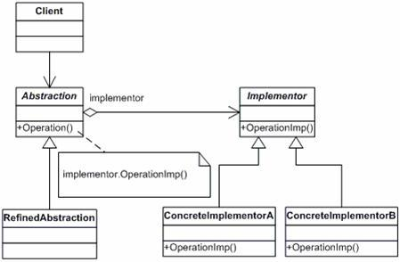

# 设计模式-----桥接模式(Bridge Pattern)应用

## 简介

- 在软件系统中，某些类型由于自身的逻辑，它具有两个或多个维度的变化，那么如何应对这种“多维度的变化”？如何利用面向对象的技术来使得该类型能够轻松的沿着多个方向进行变化，而又不引入额外的复杂度？这就要使用Bridge模式。

-  

- 网上资料介绍：[设计模式：桥接模式（Bridge）](http://blog.csdn.net/u013256816/article/details/51000327)

## 使用场景

- 项目名称：浙江音乐学院定制活动插件
- 启动时间：2017.9.11
- 插件版本：x8

浙音活动插件是为学校用户举办活动定制的一款线上报名管理审核内容插件．
活动报名形式为个人报名和团体报名．
关于报名流程，有两个维度（团体和个人），我们将报名抽象出来，关于（团体和个人）的两个维度的报名表填写管理导出流程抽象到报名EntryService里面去，具体的实现由Implementor去实现．


```
    　--> 商演活动-->（所有用户）报名-->填写报名表-->商演报名表
    |
活动
    |                                            　　  -->组合报名表
    　-->　展演活动-->（学校用户）报名-->填写报名表-->|
                                |        |        　   -->独奏报名表
                                |________|


                 -->导出商演报名汇总表   
                |
                |-->导出展演报名汇总表
导出export报名表                          --> 初审结果汇总表
                |-->导出商演结果汇总表-->|
                |                         -->　复审结果汇总表
                |-->导出展演结果汇总表
                |
                 -->导出展演学校报名汇总表
```