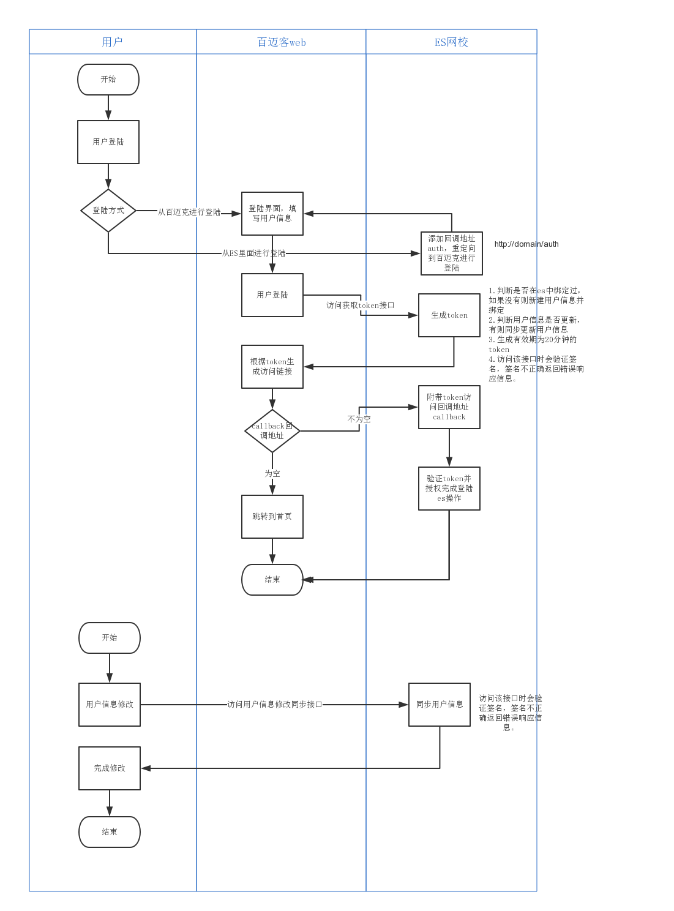

#对接用户登陆同步和授权

## 项目描述
- 项目名称：百迈克定制
- 启动时间：2017.7.24
- ES 版本：x8 <code>8.0.17</code>
- 流程图：
 
1. 用户在未登陆百迈克的时候在es中访问并且登陆的时候，会跳转到百迈克的登陆站去请求登陆，并且附带callback回调授权路径，百迈克那边登陆完成时候判断有无callback路径，有的话说明需要登陆es，则请求es的access_token接口，传递用户信息．获取access_token成功后会把access_token加到callbake的参数里，并且访问完成登陆．
2. 

## 开发前准备
1. [新的apibundle接口开发方式学习](./api-x8学习探讨.md)
2. 签名认证的实现方式
3. 用户绑定模式和token生成
4. 用户认证和授权机制

## 